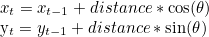
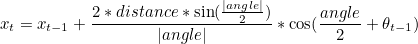
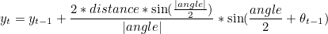
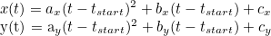

# Robotics-Motion-and-Localization

# Introduction
This collection of C++ classes simulates robot motion and applies rudimentary localization.

# Requirements
- eigen-3.3.7

# How to Use

Run the main() function within main.cpp. CMakeLists.txt has been provided.

## The Robot

The robot is able to rotate and move forwards & backwards in a 2D plane. Motion can be applied with two different options. For the first option, the robot can move in a straight line, and then rotate. For the second option, it can move and rotate simultaneously so that its path through the movement is an arc.
 
The robot's linear motion in terms of distance and heading is modeled as:
 

The robot's arc motion in terms of distance, angle, and heading is modeled as:
 

 
The robot's motion has two different noise models (uniform or normal distributions), and the code is extendable for additional models. 

The program reads in a .txt file that specifies a series of translation and rotation actions. As each move is executed incrementally, motion error is applied, and the code outputs the expected position, actual position, and error.
 
## The Kalman Filter

A simple Kalman filter applies localization that uses the robot's position as noisy sensor input. The filter assumes the robot begins at position (0,0), with uncertainty covariance of 10. The state transition matrix models <x, y, dx, dy, ddx, ddy>. Measurement uncertainty is set to 0.1.

Time is delimited in discrete steps by the input motion-input-2.txt file (t=0,1,2,. . . ).

The robot's path is specified by two parametric equations in time:

